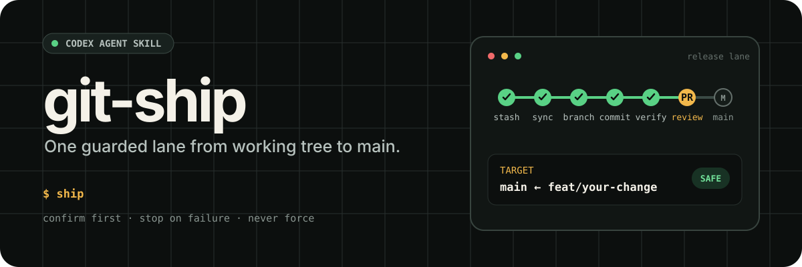
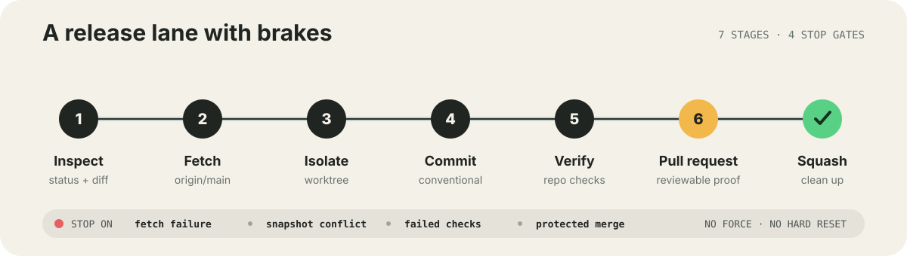

<p align="center">
  
</p>

<p align="center">
  <a href="./README.md">English</a>
</p>

`git-ship` 是一个 Agent Skill，用来完成改动写完之后那段重复的 Git 流程：

```text
工作区改动快照 → 隔离 worktree → commit → 本地验证 → PR → squash merge
```

调用 `ship` 就表示授权完整发布流程。它会自动生成分支名、Conventional Commit 和 PR 内容并直接执行；遇到冲突、验证失败或命令阻塞才会停止。

<p align="center">
  
</p>

## 它解决什么问题

- 原工作区、当前分支和索引全程保持不变。
- 基于最新 `origin/main` 创建临时 worktree，隔离发布本次改动快照。
- 每次发布都使用新的语义化分支。
- 自动生成 Conventional Commit 和清楚的 PR 摘要。
- 仅在无需安装依赖时运行仓库已有检查；依赖不可用就跳过。
- PR squash 合并后删除远端分支，并清理临时 worktree。
- 遇到冲突、未登录、验证失败或高风险歧义时立即停止。

## 安装

把仓库克隆到 Agent 能发现 Skill 的目录：

```bash
git clone https://github.com/oil-oil/git-ship.git ~/.agents/skills/git-ship
```

如果你的客户端使用其他 Skill 目录，请克隆到对应位置。真正的入口文件是 `SKILL.md`。

## 使用

完成改动并保留在工作区，然后告诉 Agent：

```text
ship
```

也可以提前指定分支和 commit：

```text
把这次改动 ship 为 feat/add-export，commit 用 "feat(export): add markdown export"
```

`git-ship` 会展示自动确定的方案，然后立即继续：

```text
📦 准备 ship：
  分支名：feat/add-export
  Commit：feat(export): add markdown export
  目标：main ← feat/add-export（squash merge）
```

不需要确认分支名、commit message、PR 标题或 PR 正文。需要特定名称时，在调用 `ship` 时直接提供即可。

## 工作流程

| 阶段 | 动作 | 安全检查 |
| --- | --- | --- |
| 检查 | 读取 status 和 diff | 没有改动时停止 |
| 同步 | 只 fetch 最新 `origin/main`，不切分支 | fetch 失败时停止 |
| 隔离 | 创建临时 worktree 并应用改动快照 | 原工作区保持不变 |
| 提交 | 在临时 worktree 中检查并提交快照 | 快照冲突时停止 |
| 验证 | 仅在依赖已经可用时运行检查 | 不安装依赖；检查不可用就跳过 |
| 发布 | push 并通过 `gh` 创建 PR | 需要完成 GitHub 登录 |
| 合并 | squash、删分支并清理 worktree | 不使用强推或硬重置 |

## 运行要求

- Git
- 已通过 `gh auth login` 登录的 [GitHub CLI](https://cli.github.com/)
- 主分支为 `main` 的 Git 仓库
- 可选：无需安装或同步依赖即可运行的仓库验证命令

如果临时 worktree 没有所需依赖，Skill 会直接跳过本地验证并继续，不会为了发布要求用户安装依赖。

## 安全边界

调用 `ship` 本身就是对完整发布流程的授权。Skill 不会为常规命名再次确认；它会把当前改动快照复制到临时 worktree，不切换原分支、不 stash，也不修改原索引。临时 worktree 中不会安装或同步依赖，缺少依赖时直接跳过验证。遇到冲突、代码检查失败、认证缺失或命令失败时立即停止。它不会使用 force push、`reset --hard` 或自动解决冲突。

## 自定义

你可以 fork 仓库并修改 `SKILL.md`，接入团队自己的分支命名、合并策略、PR 模板或必跑检查。增加自动化时，建议保留冲突和失败停止机制。

## 参与贡献

欢迎提交 Issue 和 PR。请保持改动聚焦，说明新增的 Git 行为，并为每个新增动作写清楚失败处理。

## 开源协议

[MIT](./LICENSE)
